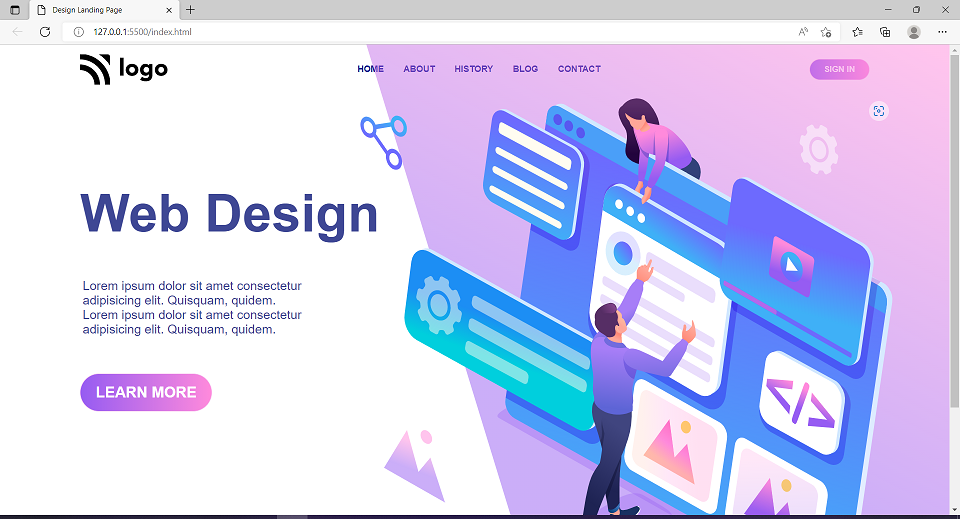

# Project-08 - A-Web-Designer-Landing-Page

## Description:

> A Web Designer's website's Landing page which will be the first web page that the potential client will see when he/she reaches designer's website.

# 

**Landing-Page-Image:**

#

## What I have learnt while making this project?

> This project helped me get better with flex CSS properties and positioning of child div elements with text and aligning it with big and small images & Div at the same time.

#

## Time taken to complete this project:
> Around 3hrs.

#

## See this project in action at below link:

**[Click to redirect to Project-08](https://p8-web-design.netlify.app/)**

#

## Developed by:

**Sidharth Pandey**

**[Contact Me](mailto:sidp0008@gmail.com)**

#